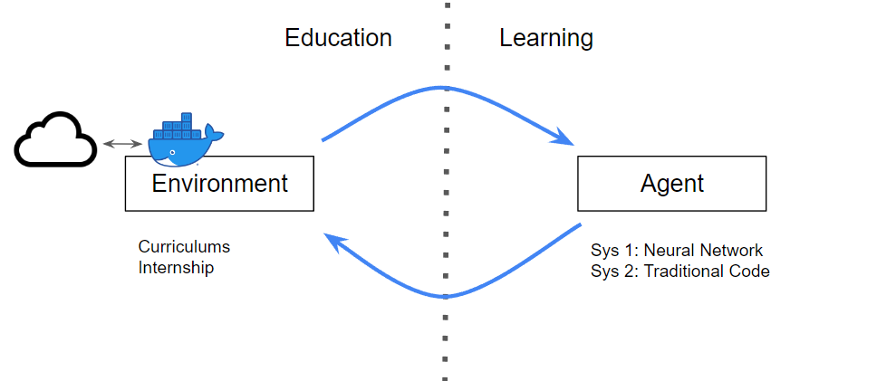

# gym-codecraft
A gym-like environment with a Docker container sandbox for the agent to learn to code.

# Main Idea

There are two seperate fields: Education and Learning.

**Education** is about creating an environment that facilitate whoever in that environment to learn. While **Learning** is about organizing the algorithms of an agent to solve novel problems.

In the context of RL, we can imagine two systems like this:



# Requirements

I'm using Windows, so `Docker Desktop` is needed. Also the Python library `docker` is needed, which can automatically get client from the environment.

The Python library `gymnasium`, which is the successor of the famous `gym`, is needed.

# Running the demo

```
python -m venv venv
source venv/bin/activate
pip install -r requirements.txt
pip install -e .
python demo.py
```

expected output:
```
(venv) gym-codecraft>python demo.py
({'obs': '\n'}, {})
{'action': 'test'}
{'obs': "No running container: please use `{'action':'reset', 'task_id':'?'}` to choose a task."}
Reward: -1
{'action': 'reset', 'task_id': '1'}
Pulling from library/python
Pulling fs layer
Waiting
Downloading: [============================>                      ]  360.4kB/622.3kB
Download complete
Downloading: [==============================>                    ]  7.588MB/12.44MB
Pull complete
Extracting: [=====================>                             ]  262.1kB/622.3kBB
Verifying Checksum
Download complete
Extracting: [==================================================>]  622.3kB/622.3kB
Pull complete
Downloading: [==================================================>]     243B/243BMB
Verifying Checksum
Download complete
Extracting: [====================================>              ]  9.175MB/12.44MB
Verifying Checksum
Download complete
Extracting: [==================================================>]  12.44MB/12.44MB
Pull complete
Extracting: [==================================================>]   3.09MB/3.09MB
Digest: sha256:25df32b602118dab046b58f0fe920e3301da0727b5b07430c8bcd4b139627fdc
Status: Downloaded newer image for python:alpine3.18
{'obs': 'Task 1:\n {\'category\': \'Python\', \'docker\': \'python:alpine3.18\', \'shell\': \'/bin/sh\', \'working_dir\': \'/tmp\', \'title\': \'Hello World\', \'description\': "Write a Python file `hello.py` printing the string \'Hello, World!\'", \'test\': "Entering the command `python hello.py` should print the string \'Hello, World!\'"}\n'}
{'action': 'lol'}
{'obs': 'Unknown action: lol'}
Reward: -1
{'action': 'command', 'command': 'pwd'}
{'obs': '/tmp\n'}
{'action': 'write_file', 'path': 'hello.py', 'content': 'print("Hello, world!")'}
{'obs': 'File hello.py written.'}
{'action': 'command', 'command': 'ls'}
{'obs': 'hello.py\n'}
{'action': 'command', 'command': 'cat hello.py'}
{'obs': 'print("Hello, world!")'}
{'action': 'command', 'command': 'python hello.py'}
{'obs': 'Hello, world!\n'}
{'action': 'submit'}
{'obs': 'Code submitted.'}
Reward: 1
{'action': 'reset', 'task_id': '2'}
Pulling from library/alpine
Already exists
Digest: sha256:82d1e9d7ed48a7523bdebc18cf6290bdb97b82302a8a9c27d4fe885949ea94d1
Status: Downloaded newer image for alpine:3.18
{'obs': "Task 2:\n {'category': 'Git', 'docker': 'alpine:3.18', 'shell': '/bin/sh', 'working_dir': '/tmp', 'title': 'Git Clone', 'description': 'Clone a repo from github, using the URL https://github.com/liusida/gym-codecraft.git', 'test': 'Check the gym-codecraft repo is in the working directory'}\n"}
{'action': 'command', 'command': 'apk update; apk add git'}
{'obs': 'fetch https://dl-cdn.alpinelinux.org/alpine/v3.18/main/x86_64/APKINDEX.tar.gz\nfetch https://dl-cdn.alpinelinux.org/alpine/v3.18/community/x86_64/APKINDEX.tar.gz\nv3.18.2-58-gf4adaceb7ff [https://dl-cdn.alpinelinux.org/alpine/v3.18/main]\nv3.18.2-58-gf4adaceb7ff [https://dl-cdn.alpinelinux.org/alpine/v3.18/community]\nOK: 20062 distinct packages available\n(1/9) Installing ca-certificates (20230506-r0)\n(2/9) Installing brotli-libs (1.0.9-r14)\n(3/9) Installing libunistring (1.1-r1)\n(4/9) Installing libidn2 (2.3.4-r1)\n(5/9) Installing nghttp2-libs (1.53.0-r0)\n(6/9) Installing libcurl (8.1.2-r0)\n(7/9) Installing libexpat (2.5.0-r1)\n(8/9) Installing pcre2 (10.42-r1)\n(9/9) Installing git (2.40.1-r0)\nExecuting busybox-1.36.1-r0.trigger\nExecuting ca-certificates-20230506-r0.trigger\nOK: 18 MiB in 24 packages\n'}
{'action': 'command', 'command': 'git --help'}
{'obs': "usage: git [-v | --version] [-h | --help] [-C <path>] [-c <name>=<value>]\n           [--exec-path[=<path>]] [--html-path] [--man-path] [--info-path]\n           [-p | --paginate | -P | --no-pager] [--no-replace-objects] [--bare]\n           [--git-dir=<path>] [--work-tree=<path>] [--namespace=<name>]\n           [--config-env=<name>=<envvar>] <command> [<args>]\n\nThese are common Git 
commands used in various situations:\n\nstart a working area (see also: git help tutorial)\n   clone     Clone a repository into a new directory\n   init      Create an empty Git repository or reinitialize an existing one\n\nwork on the current change (see also: git help everyday)\n   add       Add file contents to the index\n   mv        Move or rename a file, a directory, or a symlink\n   restore   Restore working tree files\n   rm        Remove files from the working tree and from the index\n\nexamine the history and state (see also: git help revisions)\n   bisect    Use binary search to find the commit that introduced a bug\n   diff      Show changes between commits, commit and working tree, etc\n   grep      Print lines matching a pattern\n   log       Show commit logs\n   show   
   Show various types of objects\n   status    Show the working tree status\n\ngrow, mark and tweak your common history\n   branch    List, create, or delete branches\n   commit    Record changes to 
the repository\n   merge     Join two or more development histories together\n   rebase    Reapply commits on top of another base tip\n   reset     Reset current HEAD to the specified state\n   switch    Switch branches\n   tag       Create, list, delete or verify a tag object signed with GPG\n\ncollaborate (see also: git help workflows)\n   fetch     Download objects and refs from another repository\n   pull      Fetch from and integrate with another repository or a local branch\n   push      Update remote refs along with associated objects\n\n'git help -a' and 'git help -g' list available subcommands and some\nconcept guides. See 'git help <command>' or 'git help <concept>'\nto read about a specific subcommand or concept.\nSee 'git help git' for an overview of the system.\n"}        
{'action': 'command', 'command': 'git clone https://github.com/liusida/gym-codecraft.git .'}
{'obs': "Cloning into '.'...\n"}
{'action': 'submit'}
{'obs': 'Code submitted.'}
Reward: 1
```

# Still Under Construction

### Todo:

1. Write more nice tasks in `curriculum.json`.

2. Giving correct reward based on the "test" section. Should I use GPT-3.5-turbo to generate the testing code?

3. How to construct step-by-step rewards (e.g. [Lightman, et al. 2023](https://cdn.openai.com/improving-mathematical-reasoning-with-process-supervision/Lets_Verify_Step_by_Step.pdf))

4. How to render or monitor the environment? Having a sense of how the agent is doing.

5. Make a LangChain-GPT-3.5-turbo-based agent that can play in this environment